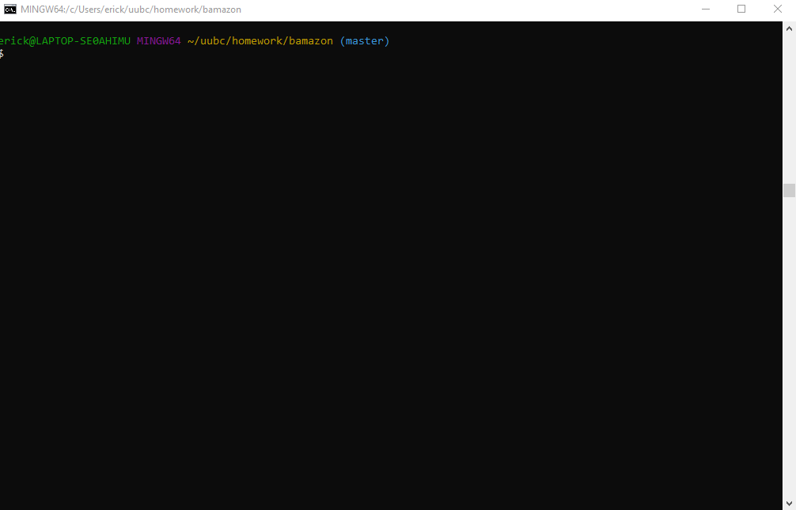

# bamazon
A Command Line Interface App

This is a command line app that simulates a simple store called "Bamazon".

## How to use

* Enter the item you which to buy
* Put in how many items you wish to buy
* It's that simple!

## Languages/Libraries used

* JavaScript
* [Node.js](https://nodejs.org/en/)
* [MySQL](https://www.mysql.com/)
* [Inquirer NPM package](https://www.npmjs.com/package/inquirer)
* [MySQL NPM package](https://www.npmjs.com/package/mysql)

## Future improvements

I will add the following:

* Manager view 
* Supervisor view

## A Gif Example

In this gif, we see the basic functionality. I type in the item I want, and then the quanity. The app tells me the price of the pruchase, and updates the mySQL database to reflect the new reduced inventory

